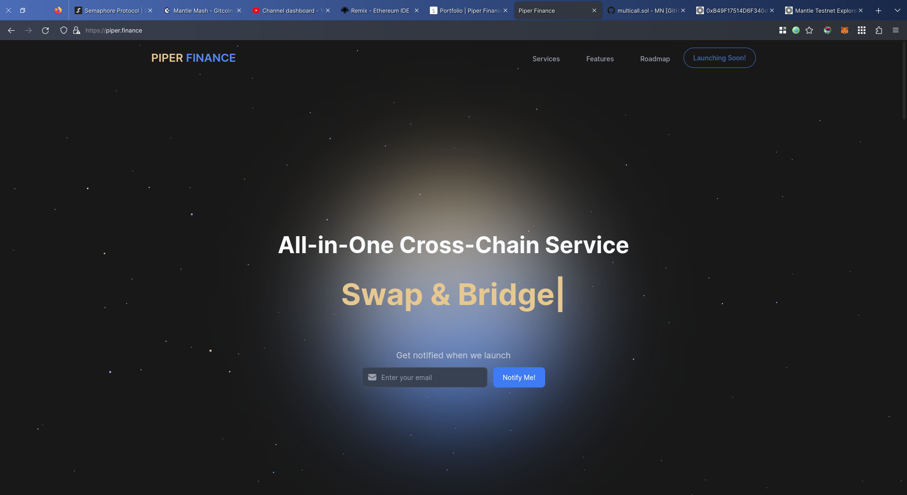
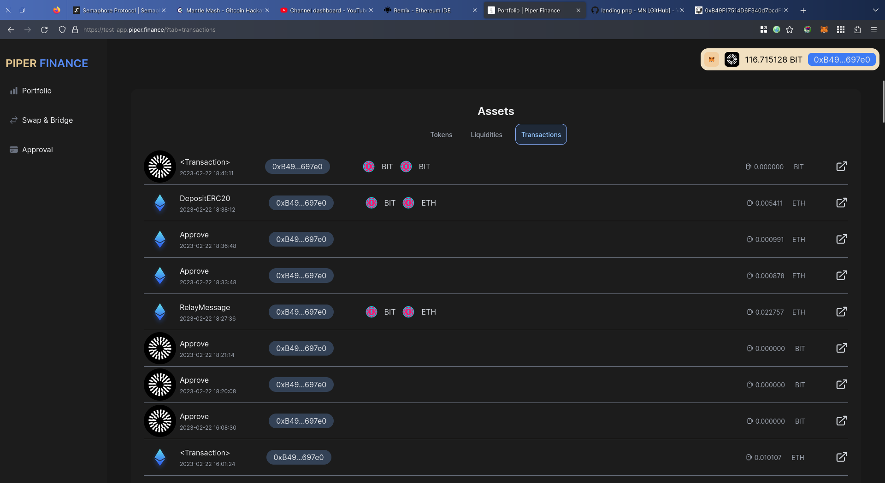
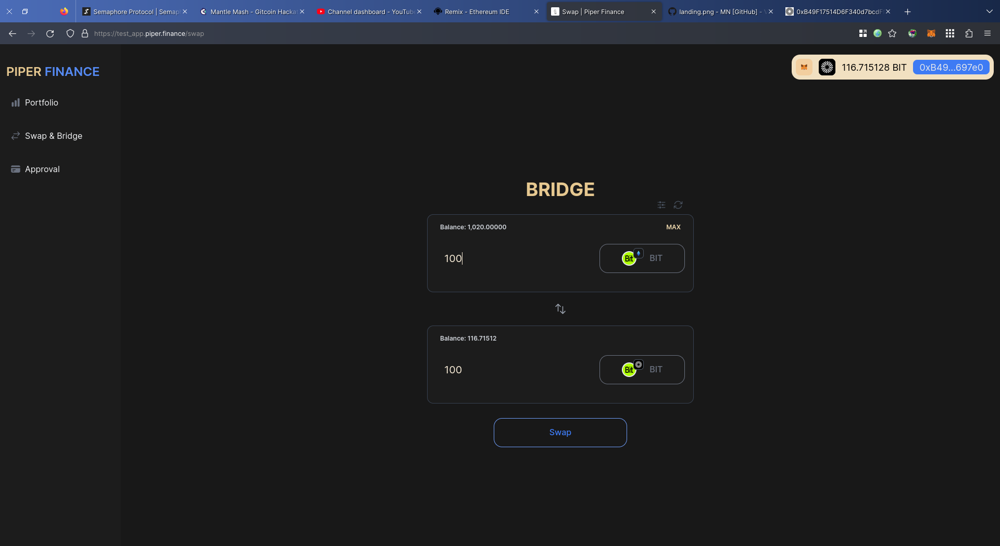

# Piper
  All-in-one tool for every user in the blockchain area [Piper Landing](https://piper.finance/)

## LINKS
- [URL: Piper Mainnet version](https://app.piper.finance/)
- [URL: Piper Testnet/Mantle version](https://test_app.piper.finance/)
- [URL: Piper Intro-video(Youtube)](https://www.youtube.com/watch?v=Bmf_VqzIJxA&ab_channel=piper)
- [URL: Multicall contract](https://explorer.testnet.mantle.xyz/address/0xF0Dc8595091708F108a17F445Eb65cff23622F94)

## Mantle network | Hackathon

- #### Portfolio
  Users easily track and manage their funds on Mantle network and other supported chains
  
  
- #### Transactions List
  Users can check transaction history on their wallets
  
  
- #### Bridge
  Users can bridge $BIT from layer1("Goerli") to Mantle network
  

- #### Approval
  Users can control their allowances
  

